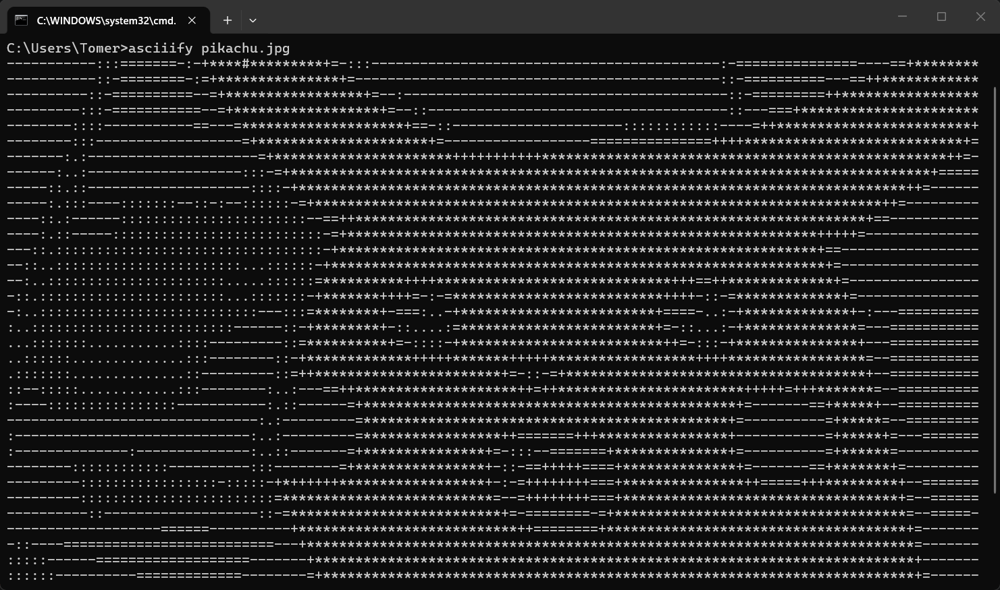

# Asciiify

<div align="center">

[](https://crates.io/crates/asciiify-core)
[](https://crates.io/crates/asciiify-cli)
[](https://pypi.org/project/asciiify)
[](https://www.npmjs.com/package/@tomerramk/asciiify)

</div>

Convert images and video to monochrome ASCII art in your terminal. Supports three output modes: classic ASCII characters, Unicode half-blocks (doubles vertical resolution), and braille patterns (highest resolution).



## Features

- **Three output modes**:
  - `ascii`: Classic character ramp (`.:-=+*#%@`)
  - `half-block`: Unicode blocks (`▀▄█`) for 2x vertical resolution
  - `braille`: Unicode braille patterns for 4x vertical resolution
- **Image support**: PNG, JPEG, GIF, BMP, WebP, TIFF, QOI
- **Video support**: MP4, MKV, AVI, MOV, WebM, FLV, WMV, MPG, MPEG (uses [ffmpeg-sidecar](https://github.com/nathanbabcock/ffmpeg-sidecar))
- **CLI tool**: Standalone binary for terminal use
- **Python bindings**: Import as `asciiify` module
- **Node.js/TypeScript bindings**: Native addon via napi-rs
- **Go bindings**: Via C FFI
- **Cross-platform**: Windows, macOS, Linux
- **Monochrome**: Grayscale brightness mapping (color support planned for future)

## Installation

### CLI Tool

The `asciiify` command is available through multiple package managers:

```bash
# Rust / Cargo
cargo install asciiify-cli

# Python / pip
pip install asciiify

# Node.js / npm (global)
npm install -g @tomerramk/asciiify

# Go
go install github.com/tomerramk/asciiify/crates/asciiify-go/cmd/asciiify@latest
```

Or download a prebuilt binary from the [GitHub Releases](https://github.com/tomerramk/asciiify/releases) page.

### As a Library

```bash
# Python
pip install asciiify

# Node.js / TypeScript
npm install @tomerramk/asciiify

# Go
go get github.com/tomerramk/asciiify/crates/asciiify-go
```

### Building from Source

<details>
<summary>Click to expand</summary>

**Prerequisites:** [Rust](https://rustup.rs), and optionally Python 3.9+, Node.js 18+, or Go 1.21+.

```bash
# Clone the repository
git clone https://github.com/tomerramk/asciiify.git
cd asciiify

# Build Node.js package
cd crates/asciiify-js && npm install && npm run build

# Build Go shared library
cargo build --release -p asciiify-go
```

</details>

## Usage

### CLI Tool

The CLI works the same regardless of how you installed it:

```bash
# Basic usage - convert image to ASCII
asciiify path/to/image.png

# Specify output mode
asciiify image.jpg -m braille

# Set dimensions
asciiify image.png -w 80 -H 25

# Invert brightness
asciiify image.png --invert

# Custom ASCII ramp (ascii mode only)
asciiify image.png --charset " .oO@"

# Output to file
asciiify image.png -o output.txt

# Video playback
asciiify video.mp4 --fps 30

# Help
asciiify --help
```

Video support is included by default in the CLI. FFmpeg is downloaded automatically on
first use.

When installed via Python, you can also use:

```bash
python -m asciiify image.png -m braille -w 100
```

### Python Library

```python
import asciiify

# Convert image file
art = asciiify.convert("image.png")
print(art)

# With options
art = asciiify.convert("image.jpg", mode="braille", width=100, height=50)

# Convert from bytes
with open("image.png", "rb") as f:
    data = f.read()
art = asciiify.convert_bytes(data, mode="half-block", width=80)

# Reusable converter
converter = asciiify.Converter(mode="ascii", width=120, invert=True)
art = converter.convert("image.png")

# Video: iterate frames as ASCII strings
from asciiify import VideoFrames

frames = VideoFrames("video.mp4", width=80)
print(f"FPS: {frames.fps}")
for frame in frames:
    print(frame)
```

### Node.js / TypeScript

```typescript
import {
  convert,
  convertBytes,
  Converter,
  VideoFrames,
} from "@tomerramk/asciiify";

// Convert image file
const art = convert("image.png");
console.log(art);

// With options
const art2 = convert("image.jpg", { mode: "braille", width: 100 });

// Convert from buffer
import { readFileSync } from "fs";
const data = readFileSync("image.png");
const art3 = convertBytes(data, { mode: "half-block", width: 80 });

// Reusable converter
const converter = new Converter({ mode: "ascii", width: 120, invert: true });
const art4 = converter.convert("image.png");

// Video: iterate frames as ASCII strings
const vf = new VideoFrames("video.mp4", { width: 80 });
console.log("FPS:", vf.fps);
let frame;
while ((frame = vf.nextFrame()) !== null) {
  console.log(frame);
}
```

### Go

```go
package main

import (
	"fmt"
	"os"

	asciiify "github.com/tomerramk/asciiify/crates/asciiify-go"
)

func main() {
	// Convert image file
	art, err := asciiify.ConvertFile("image.png", nil)
	if err != nil {
		fmt.Fprintln(os.Stderr, err)
		os.Exit(1)
	}
	fmt.Println(art)

	// With options
	art2, _ := asciiify.ConvertFile("image.jpg", &asciiify.Options{
		Mode:  "braille",
		Width: 100,
	})
	fmt.Println(art2)

	// Convert from bytes
	data, _ := os.ReadFile("image.png")
	art3, _ := asciiify.ConvertBytes(data, &asciiify.Options{
		Mode:  "half-block",
		Width: 80,
	})
	fmt.Println(art3)

	// Video: iterate frames as ASCII strings
	v, err := asciiify.OpenVideo("video.mp4", &asciiify.Options{Width: 80})
	if err != nil {
		fmt.Fprintln(os.Stderr, err)
		os.Exit(1)
	}
	defer v.Close()
	fmt.Printf("FPS: %.2f\n", v.FPS())
	for {
		frame, err := v.NextFrame()
		if err != nil {
			break
		}
		fmt.Println(frame)
	}
}
```

## Architecture

This is a Rust workspace with five crates:

- **`asciiify-core`**: Core conversion library
- **`asciiify-cli`**: Command-line interface
- **`asciiify-py`**: Python bindings via PyO3
- **`asciiify-js`**: Node.js/TypeScript bindings via napi-rs
- **`asciiify-go`**: Go bindings via C FFI

The conversion pipeline:

1. Load image/video frame
2. Resize to target character dimensions
3. Convert to grayscale
4. Map brightness to characters based on mode
5. Output as string

## Development

```bash
# Run all tests
cargo test --workspace

# Run specific crate tests
cargo test -p asciiify-core

# Check for warnings
cargo clippy --workspace -- -D warnings

# Format code
cargo fmt --workspace

# Build all crates
cargo build --workspace
```

## License

MIT License
